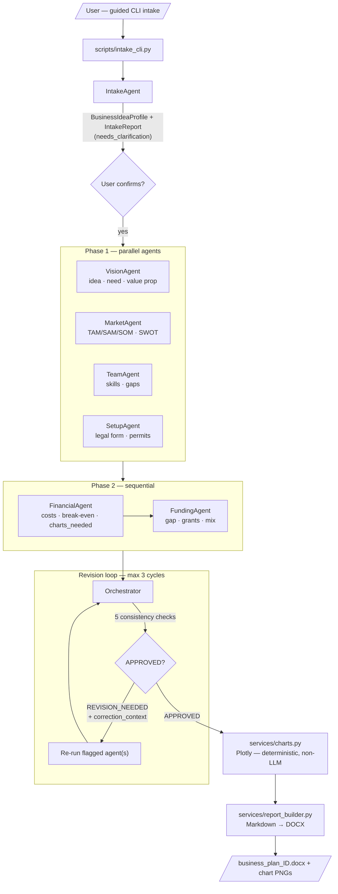
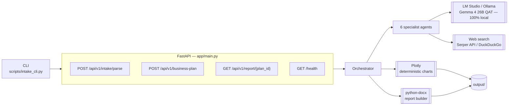
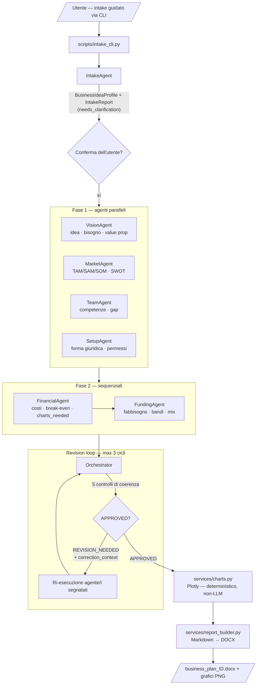

<p align="center">
  
</p>

<p align="center">
  
  
  
  
  
  
  
</p>

<p align="center">
  <a href="#-english">🇬🇧 English</a> ·
  <a href="#-italiano">🇮🇹 Italiano</a>
</p>

---

## 🇬🇧 English

### What is this

**Business Plan AI** is a **local, privacy-first multi-agent system** that turns a raw business idea into a complete, investor-ready business plan — the kind you'd hand to a bank, an incubator, or Invitalia (the Italian national agency for enterprise development).

Instead of one LLM call producing one shaky document, **six specialist agents** each own one slice of the business plan (vision, market, team, legal/operational setup, financials, funding), and an **Orchestrator** cross-checks their outputs for internal consistency before assembling the final `.docx`. If something doesn't add up — revenue projections exceeding the addressable market, missing indirect costs, unsupported claims — the Orchestrator sends the relevant agent back for a **targeted revision**, up to 3 cycles, instead of accepting a plausible-sounding but incoherent plan.

It reuses the exact same architecture (`BaseAgent` + `Orchestrator` with an explicit revision loop) as its sibling project `orgtransform-ai`, applied to the business-planning domain.

### Why it's built this way

- **No hallucinated charts.** The LLM never draws pixels. `FinancialAgent` only emits a *structured chart specification* (type, labels, values, title) after computing the numbers; the actual PNG rendering is deterministic code in `app/services/charts.py` (Plotly) — same principle as not trusting a model's output blindly, just applied to visuals instead of text.
- **A guided intake step before the expensive part.** A dedicated `IntakeAgent` interviews the user through a CLI (`scripts/intake_cli.py`), normalizes messy free-text answers into a structured `BusinessIdeaProfile`, and — critically — surfaces a `needs_clarification` list before the 6-agent pipeline (slower, more token-hungry) ever runs.
- **Everything runs locally.** The LLM is served by LM Studio / Ollama (Gemma, OpenAI-compatible endpoint) on your machine. The only traffic that leaves it is web search for market data and open grants (Serper API / DuckDuckGo) — and that traffic should never include sensitive founder data.
- **No agentic framework dependency.** Deliberately no CrewAI / LangGraph — a small custom `BaseAgent`/`Orchestrator` pattern keeps the consistency-check logic (the actual value of the system) fully explicit and inspectable.

### Architecture — pipeline



**The 5 consistency checks** the Orchestrator runs before approving a plan (the actual core of the system):

| # | Check | Catches |
|---|---|---|
| 1 | Revenue vs. market | Financial projections exceeding MarketAgent's SOM |
| 2 | Complete operating costs | Missing indirect costs (accountant, utilities, cleaning...) |
| 3 | Unsupported claims | Optimistic statements with no data/assumption behind them |
| 4 | Skills vs. ambition | Plan requiring competencies TeamAgent didn't map as covered |
| 5 | Funding gap vs. coverage | Own capital below the 25–30% rule of thumb |

### System components



### Stack

| Component | Technology |
|---|---|
| **LLM** | Gemma 4 26B QAT via LM Studio (OpenAI-compatible endpoint) |
| **Agent framework** | Custom (`BaseAgent` + `Orchestrator`, same pattern as `orgtransform-ai`) |
| **API** | FastAPI |
| **Charts** | Plotly (deterministic rendering, never generated by the LLM) |
| **Web search** | Serper API / DuckDuckGo (real-time market data and grants) |
| **Output** | Markdown → DOCX (`python-docx`) |
| **Config** | `pydantic-settings` from `.env` |

### Project structure

```
business-plan-ai/
├── app/
│   ├── main.py
│   ├── agents/
│   │   ├── base.py              # abstract BaseAgent
│   │   ├── intake_agent.py      # does NOT inherit BaseAgent — different shape by design
│   │   ├── orchestrator.py      # pipeline + revision loop
│   │   ├── vision_agent.py
│   │   ├── market_agent.py
│   │   ├── team_agent.py
│   │   ├── setup_agent.py
│   │   ├── financial_agent.py
│   │   └── funding_agent.py
│   ├── api/v1/                  # intake · business-plan · report · health
│   ├── core/
│   │   ├── types.py             # domain dataclasses
│   │   ├── prompts.py           # all system prompts, single source of truth
│   │   └── intake_questions.py
│   ├── models/                  # Pydantic request/response DTOs
│   ├── services/
│   │   ├── llm.py               # LM Studio / Ollama client
│   │   ├── charts.py            # deterministic Plotly rendering — NEVER calls the LLM
│   │   ├── web_search.py
│   │   └── report_builder.py    # Markdown → DOCX
│   └── config/settings.py
├── data/
│   ├── templates/                # blank intake template
│   └── intake/                   # user-filled intake .md files
├── output/
│   ├── charts/                   # generated PNGs
│   └── reports/                  # generated DOCX/MD
├── scripts/intake_cli.py         # guided interactive intake
├── docker-compose.yml
├── Dockerfile
├── requirements.txt
├── AGENTS.md                     # build-tracking guide for Antigravity IDE
└── business_plan_ai_spec.md      # full architecture spec (types, prompts, orchestrator)
```

### Quick start

```powershell
git clone <this-repo-url>
cd business-plan-ai

python -m venv .venv
.\.venv\Scripts\Activate.ps1
pip install -r requirements.txt

copy .env.example .env   # point it at LM Studio, optionally add SERPER_API_KEY

# Step 1 — guided intake: answers your questions, writes the .md, shows the report
python -m scripts.intake_cli

# Step 2 — start the backend to run the full pipeline
uvicorn app.main:app --reload

# in another terminal, once LM Studio is running with Gemma 4 26B QAT:
curl -Method POST http://localhost:8000/api/v1/business-plan `
  -Body (Get-Content request_example.json -Raw) -ContentType "application/json"
```

Or with Docker:

```bash
docker compose up --build
```

### API endpoints

| Method | Path | Purpose |
|---|---|---|
| `POST` | `/api/v1/intake/parse` | Parse an intake `.md` into a structured profile + report |
| `POST` | `/api/v1/business-plan` | Run the full 6-agent pipeline for a profile |
| `GET` | `/api/v1/report/{plan_id}` | Download the generated `.docx` |
| `GET` | `/health` | Liveness check |

### Notes

- The intake file is plain Markdown — you can skip the CLI entirely and fill `data/templates/business_idea_intake_template.md` by hand (Obsidian works great), then feed it to `IntakeAgent.parse_brief()` or `POST /api/v1/intake/parse`.
- Everything runs locally — no data leaves your machine except web-search queries (market/grants), which must stay free of sensitive founder data.
- The final report is a `.docx` with embedded charts, ready to present to Invitalia, banks, or investors.
- See `business_plan_ai_spec.md` for the full spec (types, prompts, orchestrator) and `AGENTS.md` for the step-by-step build guide used with Antigravity IDE.

### Tests

```powershell
pytest -q
```

### License

[MIT](LICENSE) © 2026 Vicio Di Cara

---

## 🇮🇹 Italiano

### Cos'è

**Business Plan AI** è un sistema multi-agente **locale e privacy-first** che trasforma un'idea di business grezza in un business plan completo, pronto per essere presentato a una banca, un incubatore o Invitalia.

Invece di affidarsi a un'unica chiamata LLM che produce un documento fragile, **sei agenti specialistici** coprono ciascuno un'area del business plan (vision, mercato, team, inquadramento legale/operativo, finanza, finanziamenti), e un **Orchestratore** verifica la coerenza incrociata tra i loro output prima di assemblare il `.docx` finale. Se qualcosa non torna — ricavi previsti superiori al mercato raggiungibile, costi indiretti dimenticati, affermazioni senza supporto — l'Orchestratore rimanda l'agente responsabile a una **revisione mirata**, fino a 3 cicli, invece di accettare un piano verosimile ma incoerente.

Riusa la stessa identica architettura (`BaseAgent` + `Orchestrator` con revision loop esplicito) del progetto gemello `orgtransform-ai`, applicata al dominio del business planning.

### Perché è costruito così

- **Nessun grafico allucinato.** L'LLM non disegna mai pixel. `FinancialAgent` produce solo una *specifica strutturata* del grafico (tipo, etichette, valori, titolo) dopo aver calcolato i numeri; il rendering effettivo del PNG è codice deterministico in `app/services/charts.py` (Plotly) — stesso principio di non fidarsi ciecamente dell'output del modello, applicato ai grafici invece che al testo.
- **Un passo di intake guidato prima della parte costosa.** Un `IntakeAgent` dedicato intervista l'utente via CLI (`scripts/intake_cli.py`), normalizza risposte grezze e disordinate in un `BusinessIdeaProfile` strutturato e, soprattutto, segnala una lista `needs_clarification` prima che la pipeline a 6 agenti (più lenta, più costosa in token) venga lanciata.
- **Tutto gira in locale.** L'LLM è servito da LM Studio / Ollama (Gemma, endpoint OpenAI-compatible) sulla tua macchina. L'unico traffico in uscita è la ricerca web per dati di mercato e bandi (SerperDev API / DuckDuckGo) — e non deve mai contenere dati sensibili sui soci.
- **Nessuna dipendenza da framework agentici.** Deliberatamente senza CrewAI / LangGraph — un piccolo pattern custom `BaseAgent`/`Orchestrator` mantiene la logica dei controlli di coerenza (il vero valore del sistema) completamente esplicita e ispezionabile.

### Architettura — pipeline



**I 5 controlli di coerenza** che l'Orchestratore esegue prima di approvare un piano (il vero cuore del sistema):

| # | Controllo | Individua |
|---|---|---|
| 1 | Ricavi vs. mercato | Proiezioni finanziarie superiori al SOM stimato da MarketAgent |
| 2 | Costi gestionali completi | Costi indiretti dimenticati (commercialista, utenze, pulizie...) |
| 3 | Affermazioni non dimostrabili | Claim ottimistici senza dati o assunzioni a supporto |
| 4 | Competenze vs. ambizione | Piano che richiede competenze non mappate come coperte da TeamAgent |
| 5 | Fabbisogno vs. copertura | Capitale proprio sotto la regola empirica del 25–30% |

### Componenti di sistema


### Stack

| Componente | Tecnologia |
|---|---|
| **LLM** | Gemma 4 26B QAT via LM Studio (endpoint OpenAI-compatible) |
| **Framework agenti** | Custom (`BaseAgent` + `Orchestrator`, stesso pattern di `orgtransform-ai`) |
| **API** | FastAPI |
| **Grafici** | Plotly (rendering deterministico, mai generato dall'LLM) |
| **Ricerca web** | SerperDev API / DuckDuckGo (dati di mercato e bandi in tempo reale) |
| **Output** | Markdown → DOCX (`python-docx`) |
| **Config** | `pydantic-settings` da `.env` |

### Struttura del progetto

```
business-plan-ai/
├── app/
│   ├── main.py
│   ├── agents/
│   │   ├── base.py              # BaseAgent astratto
│   │   ├── intake_agent.py      # NON eredita da BaseAgent — forma diversa apposta
│   │   ├── orchestrator.py      # pipeline + revision loop
│   │   ├── vision_agent.py
│   │   ├── market_agent.py
│   │   ├── team_agent.py
│   │   ├── setup_agent.py
│   │   ├── financial_agent.py
│   │   └── funding_agent.py
│   ├── api/v1/                  # intake · business-plan · report · health
│   ├── core/
│   │   ├── types.py             # dataclass di dominio
│   │   ├── prompts.py           # tutti i system prompt, fonte unica
│   │   └── intake_questions.py
│   ├── models/                  # DTO Pydantic request/response
│   ├── services/
│   │   ├── llm.py               # client LM Studio / Ollama
│   │   ├── charts.py            # rendering deterministico Plotly — MAI chiama l'LLM
│   │   ├── web_search.py
│   │   └── report_builder.py    # Markdown → DOCX
│   └── config/settings.py
├── data/
│   ├── templates/                # template di intake vuoto
│   └── intake/                   # file .md compilati dall'utente
├── output/
│   ├── charts/                   # PNG generati
│   └── reports/                  # DOCX/MD generati
├── scripts/intake_cli.py         # intake interattivo guidato
├── docker-compose.yml
├── Dockerfile
├── requirements.txt
├── AGENTS.md                     # guida di build per Antigravity IDE
└── business_plan_ai_spec.md      # spec completa (types, prompt, orchestrator)
```

### Avvio rapido

```powershell
git clone <url-di-questo-repo>
cd business-plan-ai

python -m venv .venv
.\.venv\Scripts\Activate.ps1
pip install -r requirements.txt

copy .env.example .env   # configura LM Studio e, opzionalmente, SERPER_API_KEY

# Passo 1 — intake guidato: risponde alle domande, scrive l'md, mostra il report
python -m scripts.intake_cli

# Passo 2 — avvia il backend per lanciare la pipeline completa
uvicorn app.main:app --reload

# in un'altra finestra, dopo aver avviato LM Studio con Gemma 4 26B QAT:
curl -Method POST http://localhost:8000/api/v1/business-plan `
  -Body (Get-Content request_example.json -Raw) -ContentType "application/json"
```

Oppure con Docker:

```bash
docker compose up --build
```

### Endpoint API

| Metodo | Path | Scopo |
|---|---|---|
| `POST` | `/api/v1/intake/parse` | Estrae da un `.md` di intake un profilo strutturato + report |
| `POST` | `/api/v1/business-plan` | Lancia la pipeline completa a 6 agenti per un profilo |
| `GET` | `/api/v1/report/{plan_id}` | Scarica il `.docx` generato |
| `GET` | `/health` | Controllo di liveness |

### Note

- Il file di intake è markdown puro: puoi saltare la CLI e compilare a mano `data/templates/business_idea_intake_template.md` (Obsidian incluso), poi passarlo a `IntakeAgent.parse_brief()` o a `POST /api/v1/intake/parse`.
- Tutto gira in locale — nessun dato esce dal PC, tranne le query di web search (mercato/bandi), che devono restare prive di dati sensibili sui soci.
- Il report finale è un `.docx` con i grafici incorporati, pronto per essere presentato a Invitalia, banche o investitori.
- Vedi `business_plan_ai_spec.md` per la spec completa (types, prompt, orchestrator) e `AGENTS.md` per la guida di build passo-passo usata con Antigravity IDE.

### Test

```powershell
pytest -q
```

### Licenza

[MIT](LICENSE) © 2026 Vicio Di Cara
