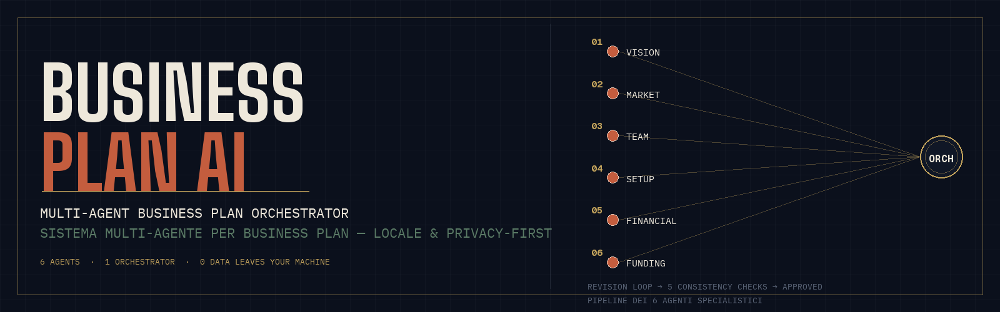
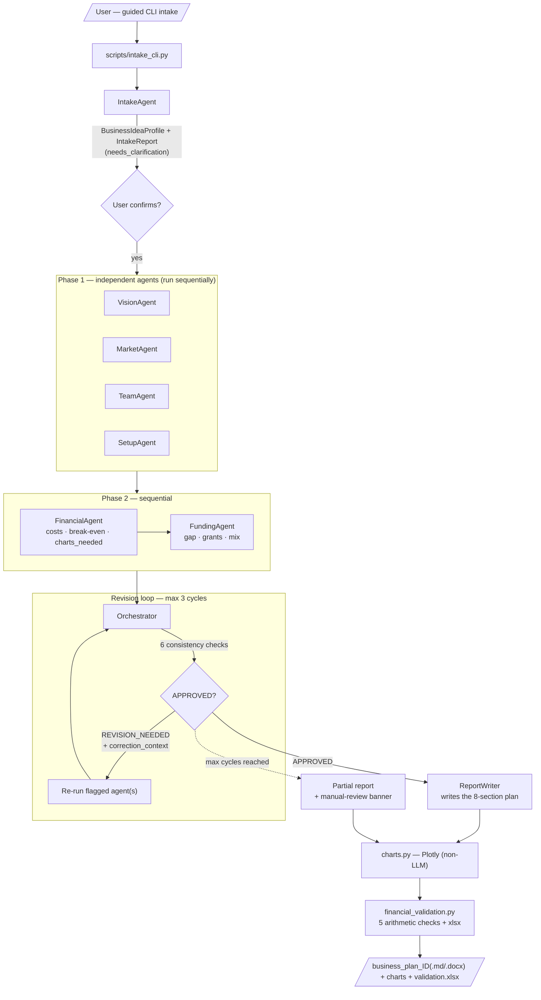
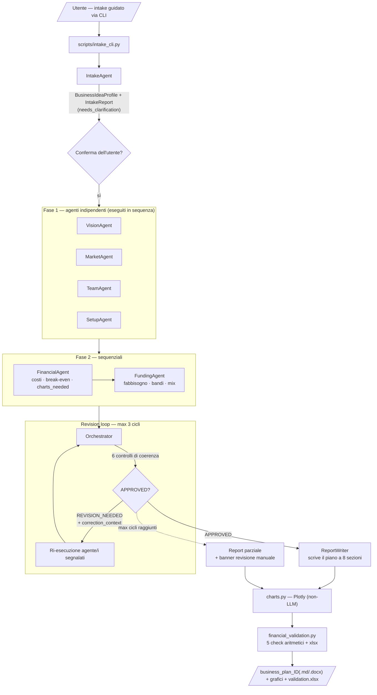

<p align="center">
  
</p>

<p align="center">
  
  
  
  
  
  
  
</p>

<p align="center">
  <a href="#-english">🇬🇧 English</a> ·
  <a href="#-italiano">🇮🇹 Italiano</a>
</p>

> Un README precedente è conservato in [`README.legacy.md`](README.legacy.md) per riferimento storico.

---

## 🇬🇧 English

### What is this

**Business Plan AI** is a **local, privacy-first multi-agent system** that turns a raw business idea into a complete business plan for Italian micro-businesses — the kind you'd hand to a bank, an incubator, or Invitalia (the Italian national agency for enterprise development).

Instead of one LLM call producing one shaky document, **six specialist agents** each own one slice of the plan (vision, market, team, legal/operational setup, financials, funding). An **Orchestrator** cross-checks their outputs for internal consistency; a separate **ReportWriter** then writes the final document. If something doesn't add up — revenue projections exceeding the addressable market, missing indirect costs, unsupported claims — the Orchestrator sends the responsible agent back for a **targeted revision**, up to 3 cycles.

After the pipeline, a **deterministic financial-validation layer** (pure Python, no LLM) re-computes the key numbers and flags any figure that doesn't reconcile — an arithmetic safety net on top of the LLM's subjective checks.

It reuses the same architecture (`BaseAgent` + `Orchestrator` with an explicit revision loop) as its sibling project `orgtransform-ai`.

### Why it's built this way

- **No hallucinated charts.** The LLM never draws pixels. `FinancialAgent` only emits a *structured chart specification*; the PNG rendering is deterministic code in `app/services/charts.py` (Plotly).
- **A guided intake step before the expensive part.** A dedicated `IntakeAgent` interviews the user through a CLI (`scripts/intake_cli.py`), normalizes messy free-text into a structured `BusinessIdeaProfile`, and surfaces a `needs_clarification` list before the 6-agent pipeline runs.
- **Deterministic arithmetic verification.** `app/services/financial_validation.py` re-derives margin, break-even, capital, coverage and revenue-vs-market with no model in the loop, and exports the result to `.xlsx`.
- **No agentic framework dependency.** Deliberately no CrewAI / LangGraph — a small custom `BaseAgent`/`Orchestrator` pattern keeps the consistency logic explicit and inspectable.

### Privacy — read this

The **`local` provider (LM Studio / Ollama) is the only one that keeps everything on your machine**, and it's the only provider that is actually tested. The only outbound traffic in that mode is web search for market data and grants (Serper API / DuckDuckGo) — which must never include sensitive founder data.

The `claude_fast` / `claude_quality` providers are **experimental and unverified**: they are wired to send prompts to Anthropic's API, so selecting them **sends your data off-machine** and breaks the privacy-first posture. They have never been validated against the real Anthropic API — treat them as a stub, not a feature.

### Architecture — pipeline



**On execution order.** The four Phase-1 agents (Vision, Market, Team, Setup) are *independent* — none consumes another's output, so their order is arbitrary — yet they run **one at a time**, not concurrently: the code is four sequential `await`s, with no `asyncio.gather`. This is deliberate: the local LLM backend (LM Studio) serves **one request at a time**, so software parallelism would buy nothing. As a consequence, a run's total time is the **sum** of the individual agent times. Phase 2 (Financial → Funding) is sequential **by necessity** — `FinancialAgent` depends on the Phase-1 outputs and `FundingAgent` depends on `FinancialAgent` — whereas in Phase 1 the sequence is merely incidental.

**The 6 consistency checks** the Orchestrator runs (LLM-based, subjective):

| # | Check | Catches |
|---|---|---|
| 1 | Revenue vs. market | Financial projections exceeding MarketAgent's SOM |
| 2 | Complete operating costs | Missing indirect costs (accountant, utilities, cleaning...) |
| 3 | Unsupported claims | Optimistic statements with no data/assumption behind them |
| 4 | Skills vs. ambition | Plan requiring competencies TeamAgent didn't map as covered |
| 5 | Funding gap vs. coverage | Own capital below the 25–30% rule of thumb |
| 6 | Fidelity to user's data | Agents silently changing the user's declared figures |

**The 5 deterministic arithmetic checks** (`financial_validation.py`, no LLM, 5% relative tolerance):

| # | Check |
|---|---|
| 1 | Unit margin = price − Σ variable costs/unit vs declared margin |
| 2 | Break-even = (Σ fixed + indirect costs) / recomputed margin vs declared |
| 3 | Sum of `initial_capital` items vs declared `initial_capital_total_eur` |
| 4 | Coverage = own capital / need vs the 25–30% rule declared by FundingAgent |
| 5 | Year-1 revenue (base scenario) ≤ market SOM |

Missing data marks a check `non_verificabile` (never raises). The result is exported to `output/reports/business_plan_{id}_{slug}_validation.xlsx` (incoherent rows highlighted red) and appended to the report as a markdown table.

### Outputs

| File | When |
|---|---|
| `output/reports/business_plan_{id}.md` / `.docx` | On APPROVED |
| `output/reports/business_plan_{id}_partial.md` / `.docx` | On non-convergence (manual-review banner) |
| `output/reports/business_plan_{id}_iter{n}_draft.md` | One per revision iteration (audit trail) |
| `output/reports/business_plan_{id}_{slug}_validation.xlsx` | Arithmetic verification |
| `output/charts/*.png` | Plotly charts |
| `logs/llm_calls.jsonl` + `logs/failed_responses/` | LLM call log + failed JSON parses |
| `data/intake/intake_*.md` | Filled intake |

### Stack

| Component | Technology |
|---|---|
| **LLM** | Gemma via LM Studio / Ollama (OpenAI-compatible endpoint) — `local`, the only tested provider |
| **Agent framework** | Custom (`BaseAgent` + `Orchestrator`, same pattern as `orgtransform-ai`) |
| **API** | FastAPI |
| **Charts** | Plotly (deterministic, never generated by the LLM) |
| **Web search** | Serper API → Playwright → ddgs (3-level fallback) |
| **Report** | Markdown → DOCX (`python-docx`), validation → XLSX (`openpyxl`) |
| **Config** | `pydantic-settings` from `.env` |

### Project structure

```
business-plan-ai/
├── app/
│   ├── main.py
│   ├── agents/                    # base, intake, orchestrator + 6 specialists
│   ├── api/v1/                    # intake · business-plan · report · health
│   ├── core/                      # types.py · prompts.py · intake_questions.py
│   ├── models/                    # Pydantic request/response DTOs
│   ├── services/
│   │   ├── llm.py                 # LM Studio / Ollama client (claude_* experimental)
│   │   ├── llm_logging.py         # JSONL logging of every LLM call
│   │   ├── charts.py              # deterministic Plotly rendering — NEVER calls the LLM
│   │   ├── web_search.py          # Serper → Playwright → ddgs fallback
│   │   ├── report_builder.py      # Markdown → DOCX/MD
│   │   └── financial_validation.py# deterministic arithmetic checks + xlsx export
│   └── config/settings.py
├── scripts/
│   ├── intake_cli.py              # guided interactive intake
│   ├── analyze_logs.py            # token/latency/convergence stats from the logs
│   └── clean_outputs.py           # wipe local output/logs/intake
├── data/ · output/ · logs/        # runtime-generated (gitignored)
├── AGENTS.md                      # build-tracking guide for Antigravity IDE
└── business_plan_ai_spec.md       # full architecture spec
```

### Quick start

```powershell
git clone <this-repo-url>
cd business-plan-ai

python -m venv .venv
.\.venv\Scripts\Activate.ps1
pip install -r requirements.txt

copy .env.example .env   # keep LLM_PROVIDER=local; point LLM_BASE_URL at LM Studio

# Step 1 — guided intake: asks the questions, writes the .md, shows the report,
#          then offers to launch the full pipeline immediately
python -m scripts.intake_cli

# Re-run report/pipeline on an already-filled intake:
python -m scripts.intake_cli parse data/intake/intake_YYYYMMDD_HHMMSS.md

# Or serve the API and drive it over HTTP:
uvicorn app.main:app --reload
```

Provider selection is via `LLM_PROVIDER` in `.env` (`local` recommended; `claude_fast` / `claude_quality` experimental — see the privacy note).

Or with Docker:

```bash
docker compose up --build
```

Inspect a run afterwards:

```powershell
python -m scripts.analyze_logs   # latency, tokens, JSON validity, convergence per run
```

### API endpoints

| Method | Path | Purpose |
|---|---|---|
| `POST` | `/api/v1/intake/parse` | Parse an intake `.md` into a structured profile + report |
| `POST` | `/api/v1/business-plan` | Run the full 6-agent pipeline (response includes `validation_xlsx_path`) |
| `GET` | `/api/v1/report/{plan_id}` | Download the generated `.docx` |
| `GET` | `/health` | Liveness check |

### Known limitations (honest)

- **The pipeline may not converge.** On financially weak ideas the Orchestrator can exhaust its 3 revision cycles without an APPROVED. In that case it still ships a **partial report** with every agent's latest output, a "REVISIONE MANUALE RICHIESTA" banner, the charts, and the arithmetic validation — a diagnosis, not a polished plan.
- **DOCX formatting is basic.** Headings, tables, bold and lists are handled, but all charts are grouped at the end ("Grafici e Proiezioni"), not inline where the text references them.
- **`claude_fast` / `claude_quality` are unverified** and send data to Anthropic's API (see the privacy note). Only `local` is tested.
- **Two LLM calls at approval** (Orchestrator decision + ReportWriter) because Gemma's forced server-side reasoning saturates a single call that tries to do both.

### Tests

```powershell
pytest -q
```

### License

[MIT](LICENSE) © 2026 Vicio Di Cara

---

## 🇮🇹 Italiano

### Cos'è

**Business Plan AI** è un sistema multi-agente **locale e privacy-first** che trasforma un'idea di business grezza in un business plan completo per micro-imprese italiane — il tipo di documento da presentare a una banca, un incubatore o Invitalia.

Invece di affidarsi a un'unica chiamata LLM che produce un documento fragile, **sei agenti specialistici** coprono ciascuno un'area del piano (vision, mercato, team, inquadramento legale/operativo, finanza, finanziamenti). Un **Orchestratore** verifica la coerenza incrociata tra i loro output; un agente separato, il **ReportWriter**, scrive poi il documento finale. Se qualcosa non torna — ricavi previsti superiori al mercato raggiungibile, costi indiretti dimenticati, affermazioni senza supporto — l'Orchestratore rimanda l'agente responsabile a una **revisione mirata**, fino a 3 cicli.

Dopo la pipeline, un **layer di validazione finanziaria deterministico** (Python puro, nessun LLM) ricalcola i numeri chiave e segnala ogni cifra che non quadra — una rete di sicurezza aritmetica sopra i controlli soggettivi dell'LLM.

Riusa la stessa architettura (`BaseAgent` + `Orchestrator` con revision loop esplicito) del progetto gemello `orgtransform-ai`.

### Perché è costruito così

- **Nessun grafico allucinato.** L'LLM non disegna mai pixel. `FinancialAgent` produce solo una *specifica strutturata* del grafico; il rendering del PNG è codice deterministico in `app/services/charts.py` (Plotly).
- **Un passo di intake guidato prima della parte costosa.** Un `IntakeAgent` dedicato intervista l'utente via CLI (`scripts/intake_cli.py`), normalizza il testo libero e disordinato in un `BusinessIdeaProfile` strutturato e segnala una lista `needs_clarification` prima che la pipeline a 6 agenti venga lanciata.
- **Verifica aritmetica deterministica.** `app/services/financial_validation.py` ricalcola margine, break-even, capitale, copertura e ricavi-vs-mercato senza modello nel loop, ed esporta il risultato in `.xlsx`.
- **Nessuna dipendenza da framework agentici.** Deliberatamente senza CrewAI / LangGraph — un piccolo pattern custom `BaseAgent`/`Orchestrator` mantiene la logica dei controlli esplicita e ispezionabile.

### Privacy — da leggere

Il **provider `local` (LM Studio / Ollama) è l'unico che tiene tutto sulla tua macchina**, ed è l'unico effettivamente testato. In quella modalità l'unico traffico in uscita è la ricerca web per dati di mercato e bandi (Serper API / DuckDuckGo) — che non deve mai contenere dati sensibili sui soci.

I provider `claude_fast` / `claude_quality` sono **sperimentali e non verificati**: sono predisposti per inviare i prompt all'API di Anthropic, quindi selezionarli **manda i tuoi dati fuori dalla macchina** e rompe la postura privacy-first. Non sono mai stati validati contro l'API Anthropic reale — trattali come uno stub, non come funzionalità.

### Architettura — pipeline



**Sull'ordine di esecuzione.** I quattro agenti di Fase 1 (Vision, Market, Team, Setup) sono *indipendenti* — nessuno usa l'output di un altro, quindi il loro ordine è arbitrario — ma vengono eseguiti **uno alla volta**, non simultaneamente: nel codice sono quattro `await` consecutivi, senza `asyncio.gather`. È una scelta voluta: il backend LLM locale (LM Studio) serve **una richiesta per volta**, quindi il parallelismo software non darebbe alcun vantaggio. Di conseguenza, il tempo totale di un run è la **somma** dei tempi dei singoli agenti. La Fase 2 (Financial → Funding) è sequenziale **per necessità** — `FinancialAgent` dipende dagli output di Fase 1 e `FundingAgent` dipende da `FinancialAgent` — mentre in Fase 1 la sequenza è solo incidentale.

**I 6 controlli di coerenza** dell'Orchestratore (basati su LLM, soggettivi):

| # | Controllo | Individua |
|---|---|---|
| 1 | Ricavi vs. mercato | Proiezioni superiori al SOM stimato da MarketAgent |
| 2 | Costi gestionali completi | Costi indiretti dimenticati (commercialista, utenze, pulizie...) |
| 3 | Affermazioni non dimostrabili | Claim ottimistici senza dati o assunzioni a supporto |
| 4 | Competenze vs. ambizione | Piano che richiede competenze non mappate come coperte da TeamAgent |
| 5 | Fabbisogno vs. copertura | Capitale proprio sotto la regola empirica del 25–30% |
| 6 | Fedeltà ai dati dell'utente | Agenti che modificano in silenzio le cifre dichiarate dall'utente |

**I 5 controlli aritmetici deterministici** (`financial_validation.py`, nessun LLM, tolleranza relativa 5%):

| # | Controllo |
|---|---|
| 1 | Margine unitario = prezzo − Σ costi variabili/unità vs margine dichiarato |
| 2 | Break-even = (Σ costi fissi + indiretti) / margine ricalcolato vs dichiarato |
| 3 | Somma voci `initial_capital` vs `initial_capital_total_eur` dichiarato |
| 4 | Copertura = capitale proprio / fabbisogno vs regola 25–30% di FundingAgent |
| 5 | Ricavo anno 1 (scenario base) ≤ SOM di mercato |

Un dato mancante marca il check come `non_verificabile` (mai un'eccezione). Il risultato è esportato in `output/reports/business_plan_{id}_{slug}_validation.xlsx` (righe incoerenti in rosso) e appeso al report come tabella markdown.

### Output prodotti

| File | Quando |
|---|---|
| `output/reports/business_plan_{id}.md` / `.docx` | Su APPROVED |
| `output/reports/business_plan_{id}_partial.md` / `.docx` | Su non-convergenza (banner revisione manuale) |
| `output/reports/business_plan_{id}_iter{n}_draft.md` | Uno per iterazione (audit trail) |
| `output/reports/business_plan_{id}_{slug}_validation.xlsx` | Verifica aritmetica |
| `output/charts/*.png` | Grafici Plotly |
| `logs/llm_calls.jsonl` + `logs/failed_responses/` | Log chiamate LLM + parsing falliti |
| `data/intake/intake_*.md` | Intake compilato |

### Stack

| Componente | Tecnologia |
|---|---|
| **LLM** | Gemma via LM Studio / Ollama (endpoint OpenAI-compatible) — `local`, unico provider testato |
| **Framework agenti** | Custom (`BaseAgent` + `Orchestrator`, stesso pattern di `orgtransform-ai`) |
| **API** | FastAPI |
| **Grafici** | Plotly (deterministico, mai generato dall'LLM) |
| **Ricerca web** | Serper API → Playwright → ddgs (fallback a 3 livelli) |
| **Report** | Markdown → DOCX (`python-docx`), validazione → XLSX (`openpyxl`) |
| **Config** | `pydantic-settings` da `.env` |

### Struttura del progetto

```
business-plan-ai/
├── app/
│   ├── main.py
│   ├── agents/                    # base, intake, orchestrator + 6 specialisti
│   ├── api/v1/                    # intake · business-plan · report · health
│   ├── core/                      # types.py · prompts.py · intake_questions.py
│   ├── models/                    # DTO Pydantic request/response
│   ├── services/
│   │   ├── llm.py                 # client LM Studio / Ollama (claude_* sperimentale)
│   │   ├── llm_logging.py         # log JSONL di ogni chiamata LLM
│   │   ├── charts.py              # rendering deterministico Plotly — MAI chiama l'LLM
│   │   ├── web_search.py          # fallback Serper → Playwright → ddgs
│   │   ├── report_builder.py      # Markdown → DOCX/MD
│   │   └── financial_validation.py# check aritmetici deterministici + export xlsx
│   └── config/settings.py
├── scripts/
│   ├── intake_cli.py              # intake interattivo guidato
│   ├── analyze_logs.py            # statistiche token/latenza/convergenza dai log
│   └── clean_outputs.py           # svuota output/logs/intake locali
├── data/ · output/ · logs/        # generati a runtime (gitignored)
├── AGENTS.md                      # guida di build per Antigravity IDE
└── business_plan_ai_spec.md       # spec completa dell'architettura
```

### Avvio rapido

```powershell
git clone <url-di-questo-repo>
cd business-plan-ai

python -m venv .venv
.\.venv\Scripts\Activate.ps1
pip install -r requirements.txt

copy .env.example .env   # lascia LLM_PROVIDER=local; punta LLM_BASE_URL a LM Studio

# Passo 1 — intake guidato: fa le domande, scrive l'md, mostra il report,
#           poi propone di lanciare subito la pipeline completa
python -m scripts.intake_cli

# Rilancia report/pipeline su un intake già compilato:
python -m scripts.intake_cli parse data/intake/intake_YYYYMMDD_HHMMSS.md

# Oppure servi l'API e guidala via HTTP:
uvicorn app.main:app --reload
```

La selezione del provider avviene con `LLM_PROVIDER` in `.env` (`local` consigliato; `claude_fast` / `claude_quality` sperimentali — vedi la nota privacy).

Oppure con Docker:

```bash
docker compose up --build
```

Analizza un run a posteriori:

```powershell
python -m scripts.analyze_logs   # latenza, token, validità JSON, convergenza per run
```

### Endpoint API

| Metodo | Path | Scopo |
|---|---|---|
| `POST` | `/api/v1/intake/parse` | Estrae da un `.md` di intake un profilo strutturato + report |
| `POST` | `/api/v1/business-plan` | Lancia la pipeline completa a 6 agenti (la risposta include `validation_xlsx_path`) |
| `GET` | `/api/v1/report/{plan_id}` | Scarica il `.docx` generato |
| `GET` | `/health` | Controllo di liveness |

### Limiti attuali (onesti)

- **La pipeline può non convergere.** Su idee finanziariamente deboli l'Orchestratore può esaurire i 3 cicli di revisione senza un APPROVED. In quel caso consegna comunque un **report parziale** con l'ultimo output di ogni agente, un banner "REVISIONE MANUALE RICHIESTA", i grafici e la validazione aritmetica — una diagnosi, non un piano rifinito.
- **La formattazione DOCX è di base.** Titoli, tabelle, grassetto e liste sono gestiti, ma tutti i grafici finiscono in coda ("Grafici e Proiezioni"), non in linea nei punti in cui il testo li richiama.
- **`claude_fast` / `claude_quality` non sono verificati** e inviano dati all'API di Anthropic (vedi nota privacy). Solo `local` è testato.
- **Due chiamate LLM all'approvazione** (decisione Orchestratore + ReportWriter): il reasoning forzato di Gemma satura una singola chiamata che tenta di fare entrambe le cose.

### Test

```powershell
pytest -q
```

### Licenza

[MIT](LICENSE) © 2026 Vicio Di Cara

---

> Nota: gli esempi e i nomi usati nella documentazione sono fittizi (es. progetto "Zagara"). I file reali di intake/output restano solo in locale e sono gitignored.
